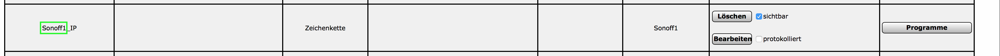
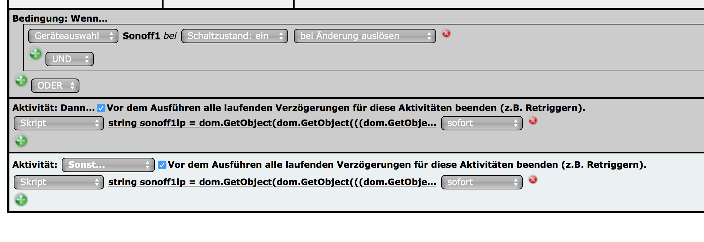

# SonoffHM
Es werden hier zwei Varianten vorgestellt wie das Sonoff Device über Homematic gesteuert werden kann. Die erste Variante wird benötigt wenn das Sonoff Device eine DHCP Adresse bezieht und keine Adressreservierung im Router eingetragen wird. An dieser Stelle wird die IP Adresse des Sonoff Devices von diesem automatisch in eine Variable in der CCU geschrieben. Das Ein- bzw. Ausschalten erfolgt dann über ein Skript, welches die Variable aufruft und die IP ausliest. Bei der zweiten Variante wird der Befehl zum Ein- und Ausschalten direkt fix im Device eingetragen. Das funktioniert jedoch nur, wenn die IP fest eingestellt ist oder wie bereits erwähnt, eine IP-Reservierung im Router eingetragen wurde, damit das Gerät immer die gleiche IP Adresse zugewiesen bekommt.

# Variante 1
**1.) Voraussetzungen:** 
  - installiertes CUxD-Addon auf der CCU
  - ein CUxD Exec-Device (was in den meisten Fällen wohl schon existiert)
    - wie man dieses installiert bitte googlen, es gibt zahlreiche Anleitungen
    - am Ende der ReadMe wird für das Exec-Device der Kanal CUxD.CUX2801001 angenommen. Muss ggf. angepasst werden
  - ein weiteres CUxD Gerät, das wie folgt erstellt wird:
    - Typ = (28) System
    - Funktion = Exec
    - Control = Schalter
    - Name = Sonoff    
  - es wird anschließend in der WebUI ein Gerät namens "Sonoff" mit 16 Kanälen erzeugt. Den ersten Kanal benenennt man um, zB in "Sonoff1". Die restlichen Kanäle kann man in der Einstellung des Geräts deaktivieren, das dient der Übersichtlichkeit.
  - eine Systemvariable, in der die IP des Sonoff gespeichert wird, vom Typ "Zeichenkette". 
      - als Namen wählt man 'GeräteName'_IP; Beispiel: Sonoff1_IP ('GeräteName' = der Name des Sonoff-Kanals des CUxD Devices)_
      
      
      


**2.) Flashen des Sonoff Devices** 
  - Wer den Code nicht selbst kompilieren möchte/kann, hat die Möglichkeit, die **'SonoffHM.ino.generic.bin'** herunterzuladen und mittels esptool direkt auf den Sonoff zu flashen. Hier der [Link zur esptool.exe!](https://github.com/thekikz/esptool/blob/master/esptool.exe) für Windows-Nutzer. Plattformunabhängig kann das Python Package [esptool](https://pypi.python.org/pypi/esptool/) genutzt werden 
  
  esptool.exe -vv -cd ck -cb 115200 -cp *COMPort* -ca 0x00000 -cf SonoffHM.ino.generic.bin

**Eine Anleitung, wie man generell Firmware auf den Sonoff bekommt (Anschluss des FTDI-Interface, Pinbelegung etc), stelle ich hier   nicht bereit. Man findet HowTos bei Google wenn man nach "sonoff flash" sucht.**

Der Flash-Vorgang muss nur 1x via FTDI-Kabel erfolgen. Anschließend ist es möglich, den Sonoff via OTA (Over-the-air) zu flashen. [Link zu espota](https://github.com/esp8266/Arduino/tree/master/tools)
    
    espota.py -i *IP* -f SonoffHM.ino.generic.bin 

**3.) Einrichtung des Sonoff Devices**

  **Bei Inbetriebnahme des Sonoff blinkt die LED in den ersten 4 Sekunden schnell.
  Wird während dessen der Taster *kurz* gedrückt, startet automatisch der Konfigurationsmodus.**
  Der Sonoff arbeitet dann als AccessPoint. 
  
  Verbindet man sich mit diesem, startet automatisch eine Konfigurationsseite. Sollte die Seite nicht automatisch geöffnet werden einfach die IP 192.168.4.1 im Browser aufrufen.
    

  Auf der Konfigurationsseite müssen nun folgende Parameter konfiguriert werden:
  - SSID / WLAN Netzwerkname zu dem sich der Sonoff verbinden soll. Sollte der Netzwerkname unbekannt sein, kann man auf der Seite auch einen Scan ausführen lassen und das erkannte WLAN auswählen.
  - WLAN-Key
  - IP der CCU (Das Feld ist durch die IP 0.0.0.0 vorbelegt)
  - Name des Sonoff Geräts - 
    **Wichtig: Der Gerätename muss mit dem Namen des CuxD Devices oder besser gesagt mit dem Namen des ersten Kanals übereinstimmen.**    Der Sonoff sucht in der CCU die Variable mit seinem Namen und dem Postfix IP (Bsp: Sonoff1_IP) und trägt dort seine aktuelle IP Adresse ein.
  - statische IP Adresse (optional)
      

  
**4.) Einrichtung der Steurung**

  Zum Schluss benötigen wir noch ein kleines Programm, dass den Schaltbefehl an den Sonoff sendet.
  

- WENN: Geräteauswahl [das CUxD-Device] "bei Schaltzustand: ein" "bei Änderung auslösen"
- DANN: Skript:

  ```string sonoffip = dom.GetObject(dom.GetObject(((dom.GetObject("$src$")).Channel()))#"_IP").Value();
dom.GetObject("CUxD.CUX2801001:1.CMD_EXEC").State("LD_LIBRARY_PATH=/usr/local/addons/cuxd /usr/local/addons/cuxd/curl -s http://"#sonoffip#"/1");```
- SONST: Skript:

  ```string sonoffip = dom.GetObject(dom.GetObject(((dom.GetObject("$src$")).Channel()))#"_IP").Value();
dom.GetObject("CUxD.CUX2801001:1.CMD_EXEC").State("LD_LIBRARY_PATH=/usr/local/addons/cuxd /usr/local/addons/cuxd/curl -s http://"#sonoffip#"/0")```

# Variante 2
Schritte 1 bis 3 sind identisch wie in Variante 1. Theoretisch könnten wir die Variable weglassen, jedoch wird der Sonoff immer versuchen seine IP Adresse in die Variable zu schreiben. Wenn er die Variable nicht findet kann dies unter Umständen zu Fehlern im Log führen. Daher lassen wir dei Variable besser bestehen.

**4.) Einrichtung der Steurung**

  Wechsel zur Oberfläche der CCU. Hier rufen wir Einstellung - Geräte auf und gehen in die Einstellung des Geräts/Kanals "Sonoff1".
  Dort wird in "SWITCH|CMD_LONG" der Einschaltbefehl eingetragen:
  
  ```/usr/local/addons/cuxd/curl -s http://{ip-des-sonoff}/1```
  
  Unter "SWITCH|CMD_SHORT" wird der Ausschaltbefehl eingetragen:
  
  ```/usr/local/addons/cuxd/curl -s http://{ip-des-sonoff}/0```
 
  Abschließend mit OK speichern und jetzt kann das Sonoff Gerät über die Homematic Oberfläche geschaltet werden.
