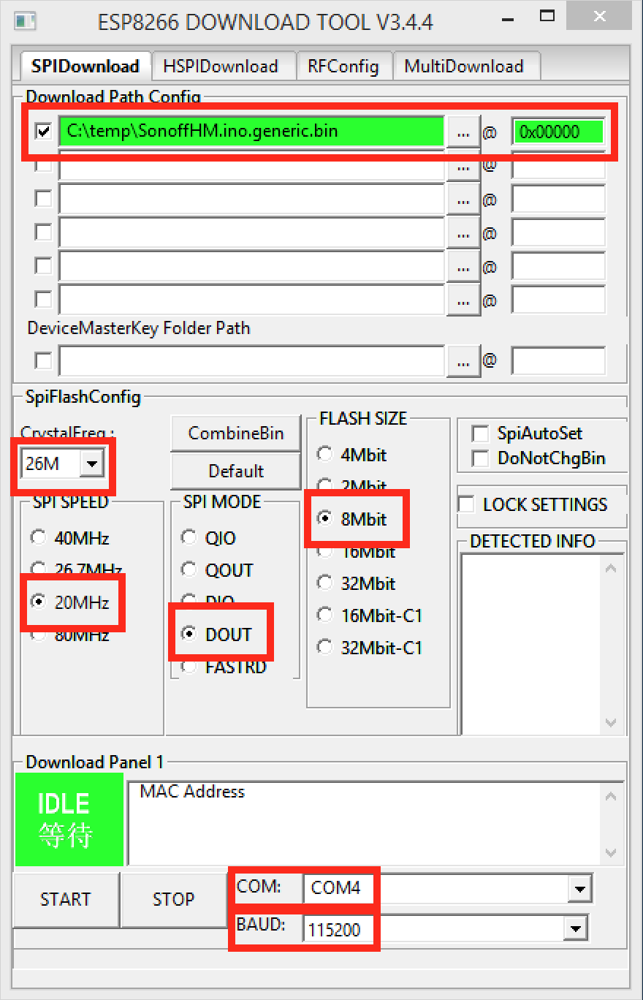

# SonoffHM

**1.) Voraussetzungen:** 
  - installiertes CUxD-Addon auf der CCU
  - ein weiteres CUxD Gerät, das wie folgt erstellt wird:
    - Typ = (28) System
    - Funktion = Exec
    - Control = Schalter
    - Name = Sonoff    
  - es wird anschließend in der WebUI ein Gerät namens "Sonoff" mit 16 Kanälen erzeugt. Den ersten Kanal benenennt man um, zB in "Sonoff1". Die restlichen Kanäle kann man in der Einstellung des Geräts deaktivieren, das dient der Übersichtlichkeit.
 
     
  
    


**2.) Flashen des Sonoff Devices** 
  - Wer den Code nicht selbst kompilieren möchte/kann, hat die Möglichkeit, die **'SonoffHM.ino.generic.bin'** herunterzuladen und mittels esptool direkt auf den Sonoff zu flashen. 
  
  Windows-Nutzer: Hier der Link zum [ESP8266 Download Tool](http://espressif.com/en/support/download/other-tools). 
  
  Dort unter der Rubrik "Flash Download Tools (ESP8266 & ESP32)" die neueste Version downloaden.
  
  Nach dem Entpacken und Starten der `ESPFlashDownloadTool_vx.x.x.exe` wählt man zunächst ESP8266 aus.
  
  Im folgenden Fenster sind die rot umrahmten Einstellungen zu treffen:
  
  
  
  _(Wobei der COM-Port "COM4" entsprechend dem eigenen COM-Port des FTDI-Adapters aus dem Gerätemanager anzupassen ist!)_
 
  Plattformunabhängig kann das Python Package [esptool](https://pypi.python.org/pypi/esptool/) genutzt werden.
  
  `esptool.py --port /dev/ttyN  --baud 115200 write_flash --flash_mode dout 0x00000 ./SonoffHM.ino.generic.bin`

**Eine Anleitung, wie man den Anschluss des FTDI-Interface an den Sonoff herstellt, stelle ich hier nicht bereit. Man findet HowTos bei Google wenn man nach "sonoff flash" sucht.**

**Bevor der Sonoff geflasht werden kann, muss er in den "Flash-Modus" versetzt werden. Dazu hält man den Taster gedrückt, während man den FTDI-Adapter an den USB-Port steckt. Danach kann der Taster losgelassen werden.**

Der Flash-Vorgang muss nur 1x via FTDI-Kabel erfolgen. Anschließend ist es möglich, den Sonoff via OTA (Over-the-air) zu flashen. [Link zu espota](https://github.com/esp8266/Arduino/tree/master/tools)
    
    espota.py -i *IP* -f SonoffHM.ino.generic.bin 

**3.) Einrichtung des Sonoff Devices**

  **Bei Inbetriebnahme des Sonoff blinkt die LED in den ersten 4 Sekunden schnell.
  Wird während dessen der Taster *kurz* gedrückt, startet automatisch der Konfigurationsmodus.**
  Der Sonoff arbeitet dann als AccessPoint. 
  
  
  

  Verbindet man sich mit diesem, startet automatisch eine Konfigurationsseite. Sollte die Seite nicht automatisch geöffnet werden einfach die IP 192.168.4.1 im Browser aufrufen.
    

  Auf der Konfigurationsseite müssen nun folgende Parameter konfiguriert werden:
  - SSID / WLAN Netzwerkname zu dem sich der Sonoff verbinden soll. Sollte der Netzwerkname unbekannt sein, kann man auf der Seite auch einen Scan ausführen lassen und das erkannte WLAN auswählen.
  - WLAN-Key
  - IP der CCU (Das Feld ist durch die IP 0.0.0.0 vorbelegt)
  - Name des Sonoff Geräts - 
    **Wichtig: Der Gerätename muss mit dem Namen des CuxD Devices oder besser gesagt mit dem Namen des ersten Kanals übereinstimmen.**    
  - Restore State: wenn aktiviert, wird bei Stromzufuhr der letzte Schaltzustand von der CCU abgefragt und wiederhergestellt
  - statische IP Adresse (optional)
  - Beispiel:
      


  
**4.) Einrichtung der Steuerung**

  Wechsel zur Oberfläche der CCU. Hier rufen wir Einstellung - Geräte auf und gehen in die Einstellung des Geräts/Kanals "Sonoff1".
  Dort wird in "SWITCH|CMD_LONG" der Einschaltbefehl eingetragen:
  
  ```/usr/local/addons/cuxd/curl -s http://{ip-des-sonoff}/1```
  
  Unter "SWITCH|CMD_SHORT" wird der Ausschaltbefehl eingetragen:
  
  ```/usr/local/addons/cuxd/curl -s http://{ip-des-sonoff}/0```
 
  Abschließend mit OK speichern und jetzt kann das Sonoff Gerät über die Homematic Oberfläche geschaltet werden.
  
  
  
# Timer-Funktion
Der Aufruf der Einschalt-URL kann um den Parameter `?t=xxx` ergänzt werden.

xxx ist dabei die Anzahl an Sekunden, die der Sonoff eingeschaltet bleiben soll.

Beispiel für einen 2-Minuten-Timer:
`http://{ip-des-sonoff}/1?t=120`

Der Timer wird deaktiviert
  - wenn ein Ausschaltbefehl (`http://{ip-des-sonoff}/0`) gesendet wird
  - wenn ein Einschaltbefehl ohne Timer-Angabe (`http://{ip-des-sonoff}/1`) gesendet wird (Dauer-Ein)

# Start des Konfigurationsmodus  - ohne - Drücken des Tasters
Ist der Sonoff einmalig fertig konfiguriert, kann der Konfigurationsmodus erneut gestartet werden, ohne dass der Taster gedrückt werden muss.

Beim Aufruf der URL `http://{ip-des-sonoff}/bootConfigMode` wird der Sonoff im Konfigurationsmodus neu gestartet.

Nach einigen Sekunden ist das Konfigurationsportal wie unter Punkt 3 erreichbar. Es können nun Änderungen an der Konfiguration vorgenommen werden.
